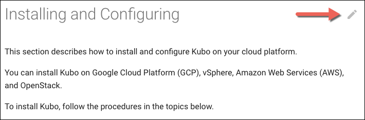

# Kubo

Welcome to the Kubo documentation!

This repo contains the content for the Kubo documentation, published at https://docs-kubo.cfapps.io. The documentation is currently under development.

## Overview

The Kubo documentation is published with [MkDocs](http://www.mkdocs.org/), using a customized version of the [Material](https://github.com/squidfunk/mkdocs-material) theme.

MkDocs is a Python application that generates a static web app from Markdown files. Each topic in the Kubo documentation is represented by a Markdown file in the [`docs`](https://github.com/cloudfoundry/docs-kubo/tree/master/docs) directory.

## How To Contribute

Please help us improve the accuracy and completeness of the Kubo documentation by contributing.

The easiest way to contribute is to file a pull request through GitHub.

To a file a pull request, perform the following steps:

1. Locate the pencil icon at the top right of the topic you're looking at.
	
1. Click the pencil icon to navigate to the GitHub page for the corresponding Markdown file.
1. Make your changes in the GitHub editor and create a pull request.

You can also [create an issue](https://github.com/cloudfoundry/docs-kubo/issues/new). Issues are repo-wide, so please indicate which topic or topics you are leaving feedback for.

## How To Style and Format Your Changes

The Kubo documentation is written in Markdown, but it also uses an MkDocs extension called Admonition that enables block-styled side content, such as notes, hints or warnings. See the [Admonition](https://squidfunk.github.io/mkdocs-material/extensions/admonition/) documentation for more information about usage.

## How To Preview Your Changes with MkDocs

You can use MkDocs to view a live version of the Kubo documentation on your local machine. This can be useful if you are submitting a pull request with substantial changes to the documentation.

Perform the following steps to preview your changes:

1. Install MkDocs on your machine by following the [instructions](http://www.mkdocs.org/#installation) on the MkDocs site.
1. Use `pip` to install the latest version of the Material theme:

	`$ pip install mkdocs-material`
	
1. Use `pip` to install the PyMdown Extensions:

	`$ pip install pymdown-extensions`
	
1. Clone this repo:

	`$ git clone https://github.com/cloudfoundry/docs-kubo.git`
	
1. Navigate to the repo on your machine.
1. Launch the MkDocs development server:

	`$ mkdocs serve`
	
1. Navigate to `localhost:8000` to see a local version of the documentation. The site will update automatically as you make changes to the Markdown files.
