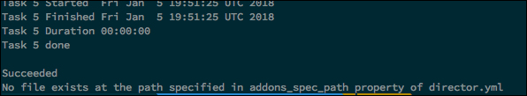

#Configuring Pluggable Add-ons

This topic describes how to configure and deploy pluggable add-ons for Cloud Foundry Container Runtime (CFCR). Pluggable add-ons are Kubernetes workloads that start immediately after CFCR cluster deployment. They let you add custom services to a CFCR cluster.

You can apply a pluggable add-on to a new or existing CFCR cluster. Applying a pluggable add-on to an existing CFCR cluster requires that you redeploy the cluster for the pluggable add-on to take effect.

## Setting Up Pluggable Add-ons

Pluggable add-ons are deployed in parallel with a CFCR cluster. Follow this procedure to apply pluggable add-ons to new or existing CFCR clusters. To set up pluggable add-ons, follow this procedure:

1. Create a YAML file describing the workloads of any add-ons you wish to use.
1. Access the `director.yml` file and add the `add-ons_spec_path` property.
1. In `director.yml`, set `add-ons_spec_path` to the path of the YAML file you created earlier.
1. Deploy or redeploy the CFCR cluster. Successful deployment returns a confirmation message (shown below).
   
    

### Troubleshooting Pluggable Add-ons

If you are redeploying an existing CFCR cluster to include add-ons, and the `director.yml` file is not found or incorrectly configured, the deployment completes, but also returns an error message. 

If you are deploying a new CFCR cluster, the deployment fails if the `director.yml` file is not found. If the file is empty or incorrectly configured, the deployment completes, but also returns an error message.

In both cases, the error message reads `No file exists at the path specified in addons_spec_path property of director.yml.`

If you configured the YAML file correctly, the new or redeployed CFCR cluster includes any pluggable add-ons you specified. 
