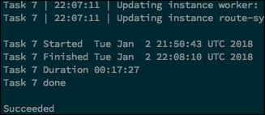

#Configuring Pluggable Add-ons

This topic describes how to configure and deploy pluggable add-ons for Cloud Foundry Container Runtime (CFCR). You can apply a pluggable add-on to a new or existing CFCR cluster. Applying a pluggable add-on to an existing CFCR cluster will require a redeploy for the pluggable add-on to take effect.

## Setting Up Pluggable Add-ons

Pluggable add-ons are deployed in parallel with a CFCR cluster. You can use this procedure to apply pluggable add-ons to new or existing CFCR clusters. To set up pluggable add-ons, follow this procedure:

1. Create a YAML file describing the workloads of any add-ons you wish to use.
1. Access the `director.yml` file and add the `add-ons_spec_path` property.
1. In `director.yml`, set `add-ons_spec_path` to the path of the YAML file you created in step 1.
1. Deploy or redeploy the CFCR cluster.

### Troubleshooting Pluggable Add-ons

If you're redeploying an existing CFCR cluster to include add-ons, and the `director.yml` file is not found or incorreclty configured, the deployment will complete with an error message.

If you're deploying a new CFCR cluster, deployment will fail if the `director.yml` file is not found. If the file is empty or incorrectly configured, the deployment will complete with an error message.

If you configured the YAML file correctly, the CFCR cluster will include any add-ons you specified. 