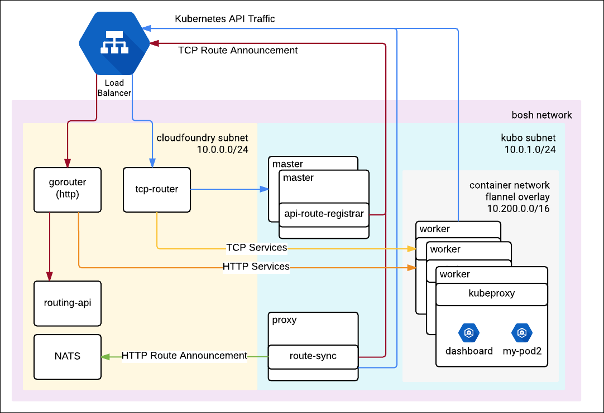

#Product Architecture

This topic describes the product architecture and components of Kubo.

## Overview

The BOSH Director manages the VMs for the Kubo instance. The Director handles VM creation, health checking, and resurrection of missing or unhealthy VMs. The Director uses CredHub and PowerDNS to handle certificate generation within the Kubo clusters. Credhub is also used to store the auto-generated passwords.

##Kubo Components

Kubo provisions a fully working Kubernetes cluster. By default, Kubo deploys

* 2 master nodes
* 3 worker nodes
* 3 etcd nodes
* 1 proxy node

	!!! note
		A single proxy front-loads all the kube-proxy running on each worker node (Note: For IAAS that support LBs, the proxy node is not required)

##Internal cluster communication

[Flannel](https://github.com/coreos/flannel) is used to create an overlay network for the Worker Nodes, such that they can all share a virtual IP subnet, regardless of their IP addressing as set by the underlying IAAS. Flannel was chosen because is the recognized standard for Kubernetes clusters.

Worker (Kubelet) to master communication is done through the apiserver. 

For master to worker communication (from the master controllers to the kubelets), the hostname of the worker nodes is announced as its IP address.

##Kubernetes Components

Kubernetes is designed around a few core principles that we'll briefly describe here. For more information see the Kubernetes documentation.

There are three logical components to every Kubernetes cluster:

* One or more master nodes
* One or more worker nodes (also previously referred to as “minions”)
* A watchable, distributed datastore (etcd) used to store cluster metadata

The master is responsible for scheduling and controlling the workloads on the workers. It is made up of a few loosely coupled components:

* The API (apiserver): provides a means of interacting with the master for both end-users and other internal components. The API itself is stateless and all data is stored in etcd.
* The scheduler: this component is responsible for picking a worker for a particular workload.
* The controller manager: this component is responsible for checking if a desired state is reached, and if not, to submit commands to master to work towards it.

The worker is also made up of a few components:

* The kubelet: this component is in charge of the worker node and is the entrypoint for communication from the master. It keeps track of available resources and running processes, amongst other things.
* The proxy: the kube-proxy makes sure the service CIDR is routable and packets are forwarded correctly. (you can have a look at iptables -L -t nat to witness this magic).
* The container runtime (docker for kubo): used to run the containers/pods.

The etcd nodes store all the metadata used by the scheduler and controller manager to operate the cluster. This includes current state of each worker, pods running in the cluster, etc as well as the desired state as defined by the users of the cluster.

## Networking Topology using IaaS Load Balancers

The nodes that run the Kubernetes API (master nodes) are exposed through an IaaS specific load balancer. The load balancer will have an external static IP address that is used as a public and internal endpoint for traffic to the Kubernetes API.

Kubernetes services can be exposed using a second IaaS specific load balancer which forwards traffic to the Kubernetes worker nodes.

## Networking Topology using Cloud Foundry Routing

The nodes that run the Kubernetes API (master nodes) register themselves with the Cloud Foundry TCP router. The TCP Router acts as both public and internal endpoint for the Kubernetes API to route traffic to the master nodes of a Kubo instance. All traffic to the API goes through the Cloud Foundry TCP router and then to a healthy node.

The Cloud Foundry subnet must be able to route traffic directly to the Kubo subnet. It is recommended to keep them in separate subnets when possible to avoid the BOSH directors from trying to provision the same addresses. This diagram specifies CIDR ranges for demonstration purposes as well as a public router in front of the Cloud Foundry gorouter and tcp-router which is typical.

